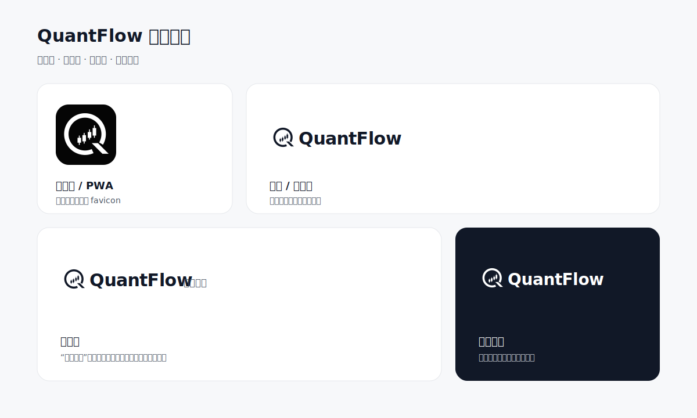

# QuantFlow 品牌资源

所有正式资源由唯一母版 `source/quantflow-mark-optimized.svg` 派生：保持 Q、上升 K 线和斜向尾部的识别结构，使用平滑矢量曲线，并完成光学居中校准。旧锯齿母版和重复中间资源不保留，避免实现时误用。



## 资源选择

| 场景                     | 首选资源                                                             | 说明                                             |
| ------------------------ | -------------------------------------------------------------------- | ------------------------------------------------ |
| 浏览器标签               | `svg/favicon.svg`                                                    | 现代浏览器优先使用；同时保留 16/32/48 PNG 回退   |
| Apple 主屏幕             | `png/apple-touch-icon-180.png`                                       | 180 × 180                                        |
| PWA 普通图标             | `png/pwa-icon-192.png`、`png/pwa-icon-512.png`                       | 黑底白标                                         |
| PWA maskable             | `png/pwa-maskable-192.png`、`png/pwa-maskable-512.png`               | 额外安全区，避免系统蒙版裁掉图形                 |
| 官网与用户端浅色表面     | `svg/quantflow-lockup-on-light.svg`                                  | 标准横版组合                                     |
| 管理端展开侧栏           | `svg/quantflow-admin-lockup-on-light.svg`                            | “管理后台”是区域描述，不是中文品牌名             |
| 折叠侧栏、移动端、头像位 | `svg/quantflow-mark.svg`                                             | 深色图形、透明背景                               |
| 局部深色表面             | `svg/quantflow-mark-white.svg` 或 `svg/quantflow-lockup-on-dark.svg` | 仅用于页脚等局部深色区域；MVP 不因此启用深色主题 |

## UI 接入规则

1. 实际应用头部优先使用独立图形 SVG，并用 HTML 文本渲染 `QuantFlow`，避免组合 SVG 中的系统字体在不同平台产生差异。
2. 官网和用户端桌面头部建议图形高 `32px`；移动端建议 `24–28px`；管理端展开侧栏建议 `28–32px`，折叠侧栏建议 `28px`。图形与品牌文字的可见间距统一为 `8px`，不得按 SVG 透明画布边界重复增加间距。
3. 图形最小显示尺寸为 `16px`。常规 UI 四周至少保留图形宽度 `25%` 的净空。优化母版已按 Q 尾部造成的视觉重心偏移完成光学校准，不得再对单个场景手工增加位置偏移。
4. 禁止拉伸、旋转、加阴影、加渐变、改变图形比例，或把收益/亏损语义色用作 Logo 色。
5. 浅色主题使用 `#111827` 图形；深色局部表面使用白色图形；方形应用图标固定使用 `#050505` 背景与白色图形。
6. `QuantFlow` 是唯一品牌名。中文只可用作“管理后台”等区域或功能描述。

## Web 接入示例

将选定资源复制到应用的 `public/brand/` 后，可在页面头部使用：

```html
<link rel="icon" href="/brand/favicon.svg" type="image/svg+xml" />
<link rel="icon" href="/brand/favicon-32.png" sizes="32x32" type="image/png" />
<link rel="apple-touch-icon" href="/brand/apple-touch-icon-180.png" />
<link rel="manifest" href="/site.webmanifest" />
```

PWA manifest 可从 `site.webmanifest.example` 开始配置。路径是目标应用的公开 URL，不应直接引用仓库内的源文件路径。

## 重新生成

在 macOS 和 Node.js 24 环境运行：

```bash
node scripts/generate-brand-assets.mjs
```

脚本依赖系统自带的 `qlmanage` 和 `sips` 生成 PNG。修改优化母版后必须重新生成全部派生资源，并同时检查 16px 小尺寸和高分辨率放大效果。
